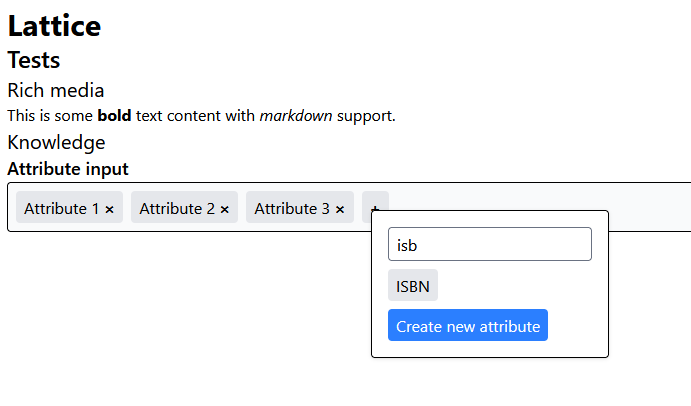

# Lattice: Devlog 1

## Introduction

In the end, Lattice will have be a full-featured learning system.

The core ideas behind Lattice are:
- Engaging, interactive lessons
- Fraud/cheat detection & redirection
- Social learning via cohorts
- Gamification via collectibles & achievements

## Current Progress

### Course Content

I have created types for progression through modules & sections.

In addition, I added simple rich media support (see in the screenshot below).

There is support for getting assets from bucket storage, which should be useful later on.

### "Knowledge" System

The idea behind the "knowledge" system is to track what a learner has learned.

In doing so, we also track all the content in the world, and what relationships exist between content.

I have typed out the basic structure for this.

Additionally, I made components & API routes for querying & creating knowledge attributes. Attributes are the different pieces of information attached to a knowledge item (e.g. ISBN for a book, or birthdate for a person).

### Usability

Although not yet ready for use, all of Lattice has been designed with future usability in mind.

Lattice is not meant to be a standalone product. It is fully embeddable within other Svelte applications.

This means that Lattice's UI is minimal & non-intrusive.

## Screenshot

